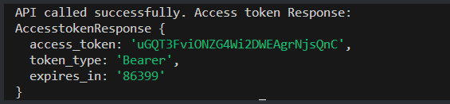

# XI SDK Quickstart for Node


[Repository GitHub](https://github.com/ingrammicro-xvantage/xi-sdk-resellers-node)

[SDK document](https://github.com/ingrammicro-xvantage/xi-sdk-resellers-node/tree/main/docs)

[Package Url](https://www.npmjs.com/~xvantage-integration)

# Prerequisites
Node.js installed on your system. You can download it from [nodejs.org](https://nodejs.org/).

### Steps:
1. **Create a New Directory**
Open your terminal or command prompt and create a new directory for your project:


```
mkdir nodejs_test
cd nodejs_test
```


 

2. **Initialize npm**
Inside your project directory, run the following command to initialize npm:

```
npm init
```

You'll be prompted to enter details like package name, version, description, etc. You can press Enter to accept the default values or fill in your project details.

3. **Create Your JavaScript File**
Now, create a JavaScript file in your project directory. You can name it `app.js`:

for Windows:

```
echo > app.js
```

4. **Install xi_sdk_resellers**

Now install [xi_sdk_resellers](https://www.npmjs.com/package/xi_sdk_resellers) package. In terminal run:

```
npm i xi_sdk_resellers
```

5. **Write Your JavaScript Code**

Open `app.js` in a text editor and write your JavaScript code. Below is an example to retrieve the access token:

```node
var XiSdkResellers = require('xi_sdk_resellers');


var api = new XiSdkResellers.AccesstokenApi()
var grantType = "client_credentials"; // {String} Keep grant_type as client_credentials only.
var clientId = "<PUT YOUR CLIENT ID HERE>"; // {String} 
var clientSecret = "<PUT YOUR CLIENT SECRET HERE>"; // {String} 
var callback = function(error, data, response) {
  if (error) {
    console.error(error);
  } else {
    console.log('API called successfully. Access token Response:');
    console.log(data)
  }
};
api.getAccesstoken(grantType, clientId, clientSecret, callback);
```

* Replace ClientId with your ClientId.
* Replace ClientId with your Client secret.

6. **Run Your Application**

Finally, run your JavaScript console application using Node.js. In your terminal, execute the following command:

```
node app.js
```

If both the client ID and client secret are correct you will get a response something like this:



7. Here is Another Example of a Product Search Response:

```node
var XiSdkResellers = require('xi_sdk_resellers');
var defaultClient = XiSdkResellers.ApiClient.instance;
// Configure OAuth2 access token for authorization: application
defaultClient.basePath = 'https://api.ingrammicro.com:443/sandbox';

let application = defaultClient.authentications['application'];
application.accessToken = "<Enter your Access token Here";
let apiInstance = new XiSdkResellers.ProductCatalogApi();
let iMCustomerNumber = "20-222222"; // String | Your unique Ingram Micro customer number
let iMCorrelationID = "fbac82ba-cf0a-4bcf-fc03-0c5084"; // String | Unique transaction number to identify each transaction accross all the systems
let iMCountryCode = "US"; // String | Two-character ISO country code.
let opts = {
  'iMSenderID': "IMCEP",
  'pageNumber': 1, // Number | Current page number. Default is 1
  'pageSize': 5 // String | Sender Identification text
};
apiInstance.getResellerV6Productsearch(iMCustomerNumber, iMCorrelationID, iMCountryCode, opts, (error, data, response) => {
  if (error) {
    console.error(error);
  } else {
    console.log('API called successfully. Returned data: ' );
    console.log(data)
  }
});
```

* Replace your application information at the below section in the code:
  * Your IM customer number
  * Your country code
  * Your Correlation ID

By default, the base URL will be: `https://api.ingrammicro.com:443/`

For sandbox testing add below : 

```
var XiSdkResellers = require('xi_sdk_resellers');
var defaultClient = XiSdkResellers.ApiClient.instance;
// Configure OAuth2 access token for authorization: application
defaultClient.basePath = 'https://api.ingrammicro.com:443/sandbox';
```

If Everything is correct you will get a response something like this:


